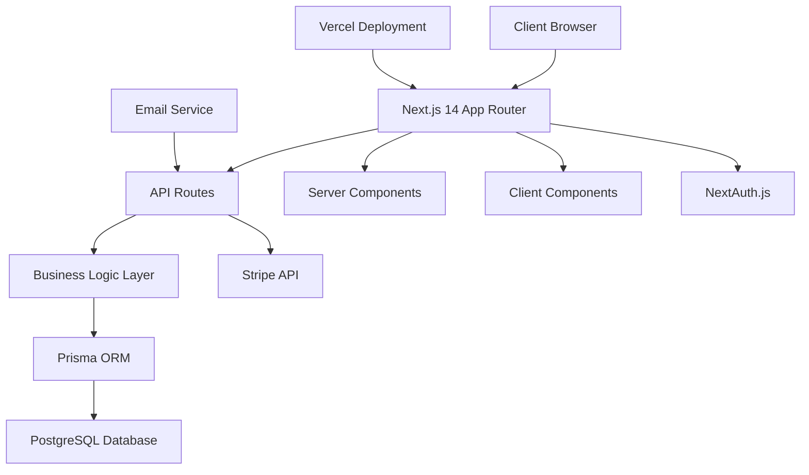
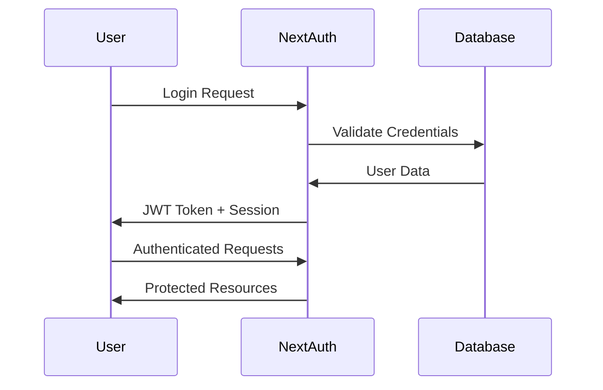
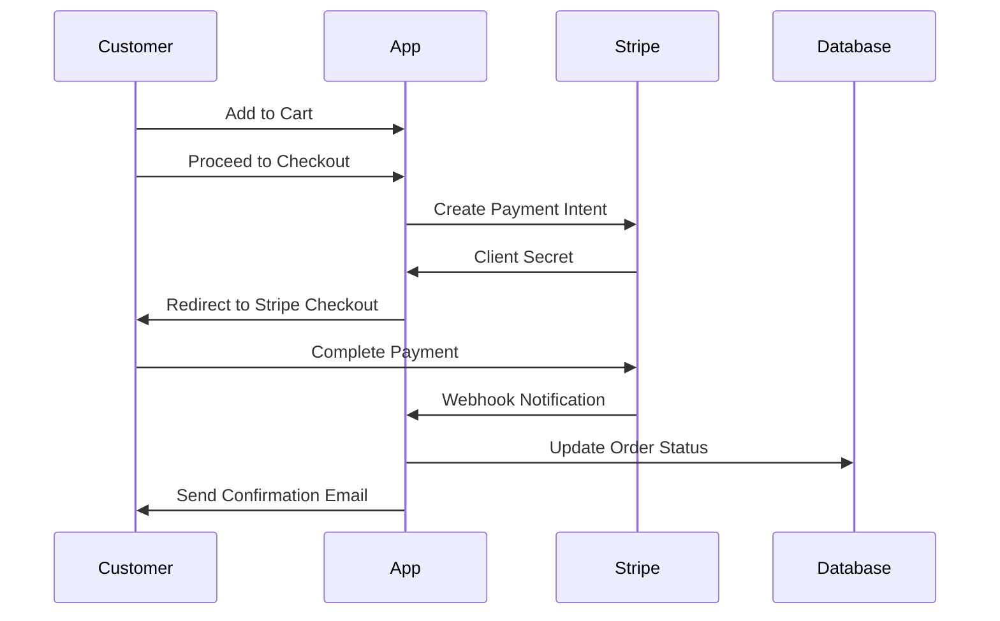

# E-commerce Platform Design Document

## Overview

This design document outlines the architecture for a modern e-commerce platform built with Next.js 14, leveraging the App Router for optimal performance and SEO. The system follows a layered architecture with clear separation between presentation, business logic, and data access layers. The platform is designed to be scalable, maintainable, and optimized for both user experience and search engine visibility.

## Architecture

### High-Level Architecture



### Technology Stack

- **Frontend Framework**: Next.js 14 with App Router
- **Styling**: TailwindCSS for responsive design
- **Database**: PostgreSQL with Prisma ORM
- **Authentication**: NextAuth.js
- **Payments**: Stripe Checkout and API
- **Deployment**: Vercel
- **Email**: Resend or similar service for transactional emails
- **Development Database**: Docker PostgreSQL container

### Folder Structure

```
src/
├── app/
│   ├── (auth)/
│   │   ├── login/
│   │   └── register/
│   ├── (shop)/
│   │   ├── products/
│   │   ├── cart/
│   │   └── checkout/
│   ├── admin/
│   │   ├── dashboard/
│   │   ├── products/
│   │   └── orders/
│   ├── api/
│   │   ├── auth/
│   │   ├── products/
│   │   ├── orders/
│   │   └── stripe/
│   ├── globals.css
│   ├── layout.tsx
│   └── page.tsx
├── components/
│   ├── ui/
│   ├── forms/
│   ├── layout/
│   └── admin/
├── lib/
│   ├── auth.ts
│   ├── db.ts
│   ├── stripe.ts
│   └── utils.ts
├── types/
└── prisma/
    ├── schema.prisma
    └── migrations/
```

## Components and Interfaces

### Core Data Models

#### User Model
```typescript
interface User {
  id: string
  email: string
  name: string
  role: 'CUSTOMER' | 'ADMIN'
  createdAt: Date
  updatedAt: Date
  orders: Order[]
}
```

#### Product Model
```typescript
interface Product {
  id: string
  name: string
  description: string
  price: number
  images: string[]
  inventory: number
  category: string
  slug: string
  isActive: boolean
  createdAt: Date
  updatedAt: Date
  orderItems: OrderItem[]
}
```

#### Order Model
```typescript
interface Order {
  id: string
  userId: string
  status: 'PENDING' | 'PAID' | 'FULFILLED' | 'CANCELLED'
  total: number
  stripePaymentIntentId: string
  createdAt: Date
  updatedAt: Date
  user: User
  items: OrderItem[]
}
```

#### OrderItem Model
```typescript
interface OrderItem {
  id: string
  orderId: string
  productId: string
  quantity: number
  price: number
  order: Order
  product: Product
}
```

### Key Components

#### Frontend Components

1. **ProductCard**: Displays product information with responsive design
2. **ProductGrid**: Grid layout for product listings with filtering
3. **ShoppingCart**: Cart management with real-time updates
4. **CheckoutForm**: Stripe checkout integration
5. **AdminProductForm**: Product creation and editing interface
6. **OrderManagement**: Admin interface for order fulfillment
7. **SEOHead**: Dynamic meta tags and structured data generation

#### API Endpoints

1. **Products API** (`/api/products`)
   - GET: Fetch products with pagination and filtering
   - POST: Create new product (admin only)
   - PUT: Update product (admin only)
   - DELETE: Remove product (admin only)

2. **Orders API** (`/api/orders`)
   - GET: Fetch user orders or all orders (admin)
   - POST: Create new order
   - PUT: Update order status (admin only)

3. **Stripe API** (`/api/stripe`)
   - POST `/create-payment-intent`: Initialize Stripe checkout
   - POST `/webhook`: Handle Stripe webhooks for payment confirmation

4. **Auth API** (`/api/auth`)
   - Handled by NextAuth.js with custom providers

### Authentication Flow



### Payment Flow



## Data Models

### Database Schema (Prisma)

```prisma
model User {
  id        String   @id @default(cuid())
  email     String   @unique
  name      String
  role      Role     @default(CUSTOMER)
  createdAt DateTime @default(now())
  updatedAt DateTime @updatedAt
  orders    Order[]
}

model Product {
  id          String      @id @default(cuid())
  name        String
  description String
  price       Float
  images      String[]
  inventory   Int
  category    String
  slug        String      @unique
  isActive    Boolean     @default(true)
  createdAt   DateTime    @default(now())
  updatedAt   DateTime    @updatedAt
  orderItems  OrderItem[]
}

model Order {
  id                    String      @id @default(cuid())
  userId                String
  status                OrderStatus @default(PENDING)
  total                 Float
  stripePaymentIntentId String?
  createdAt             DateTime    @default(now())
  updatedAt             DateTime    @updatedAt
  user                  User        @relation(fields: [userId], references: [id])
  items                 OrderItem[]
}

model OrderItem {
  id        String  @id @default(cuid())
  orderId   String
  productId String
  quantity  Int
  price     Float
  order     Order   @relation(fields: [orderId], references: [id])
  product   Product @relation(fields: [productId], references: [id])
}

enum Role {
  CUSTOMER
  ADMIN
}

enum OrderStatus {
  PENDING
  PAID
  FULFILLED
  CANCELLED
}
```

## Error Handling

### Client-Side Error Handling
- React Error Boundaries for component-level errors
- Toast notifications for user-facing errors
- Form validation with real-time feedback
- Graceful fallbacks for failed API calls

### Server-Side Error Handling
- Centralized error handling middleware
- Structured error responses with appropriate HTTP status codes
- Logging integration for debugging and monitoring
- Stripe webhook signature verification

### Error Types
```typescript
interface APIError {
  code: string
  message: string
  details?: any
}

// Common error codes
const ErrorCodes = {
  VALIDATION_ERROR: 'VALIDATION_ERROR',
  UNAUTHORIZED: 'UNAUTHORIZED',
  PRODUCT_NOT_FOUND: 'PRODUCT_NOT_FOUND',
  INSUFFICIENT_INVENTORY: 'INSUFFICIENT_INVENTORY',
  PAYMENT_FAILED: 'PAYMENT_FAILED',
  ORDER_NOT_FOUND: 'ORDER_NOT_FOUND'
} as const
```

## Testing Strategy

### Unit Testing
- Jest and React Testing Library for component testing
- Prisma client mocking for database operations
- Stripe API mocking for payment flow testing
- NextAuth session mocking for authentication testing

### Integration Testing
- API route testing with test database
- End-to-end checkout flow testing
- Admin dashboard functionality testing
- Email delivery testing with mock services

### Performance Testing
- Lighthouse CI for Core Web Vitals monitoring
- Load testing for concurrent user scenarios
- Database query optimization testing
- Image optimization and loading performance

### Test Structure
```
__tests__/
├── components/
├── pages/
├── api/
├── utils/
└── e2e/
    ├── checkout.test.ts
    ├── admin.test.ts
    └── auth.test.ts
```

## SEO Implementation

### Metadata Generation
- Dynamic meta tags based on product/page content
- Open Graph tags for social media sharing
- Twitter Card metadata
- Canonical URLs for duplicate content prevention

### Structured Data
- Product schema markup (JSON-LD)
- Organization schema for business information
- Breadcrumb navigation schema
- Review and rating schema (future enhancement)

### Sitemap Generation
- Automatic sitemap generation for all products and categories
- Dynamic updates when products are added/removed
- Proper priority and change frequency settings
- Integration with Google Search Console

## Performance Optimizations

### Next.js 14 Features
- App Router for improved performance and developer experience
- Server Components for reduced client-side JavaScript
- Incremental Static Regeneration (ISR) for product pages
- Image optimization with next/image component
- Font optimization with next/font

### Caching Strategy
- Static generation for product category pages
- ISR for individual product pages (revalidate every hour)
- Client-side caching for cart state
- Database query optimization with Prisma

### Bundle Optimization
- Code splitting by route and component
- Dynamic imports for heavy components
- Tree shaking for unused code elimination
- Compression and minification in production